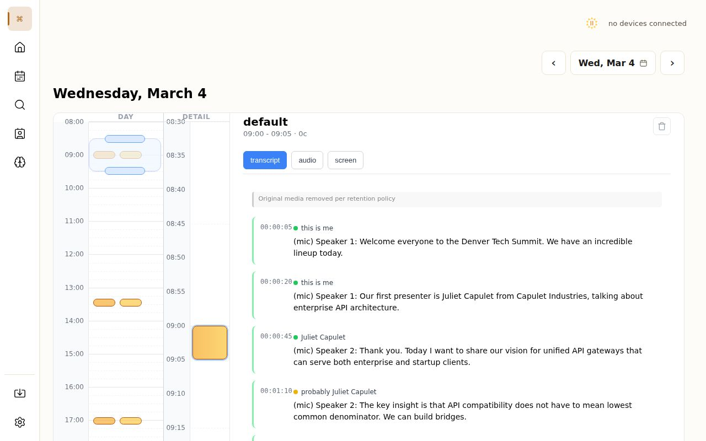
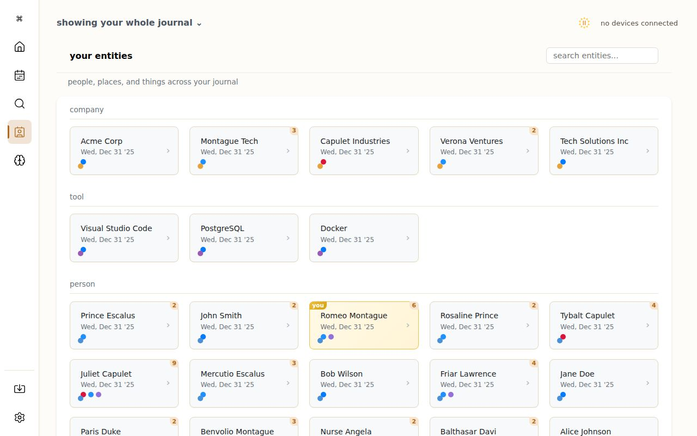
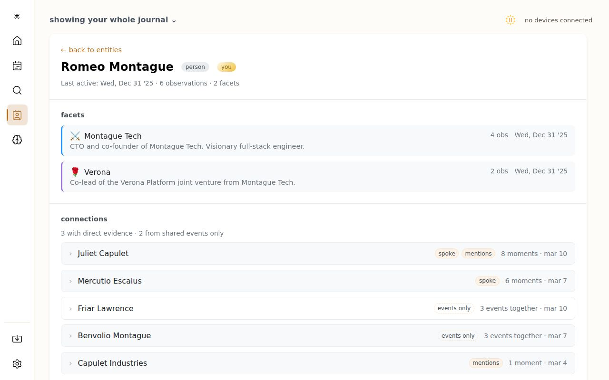

# the journal

**A memory your agents can work from. On your device, owned by you.**

solstone is a personal memory platform. The solstone app takes in what you share with it, and all of it goes into your journal. This repository is the journal: the part that runs on a computer you own. It holds everything the solstone app takes in, turns audio into speaker-attributed transcripts, turns screen frames into descriptions, surfaces the people, projects, meetings and commitments in your days, indexes all of it, and gives the agents you already use a way to work from it.

Your journal is a folder of dated directories on a machine you choose. You can read it, back it up, move it, and hand it down. Open source, local-first, AGPL-3.0-only, made by [sol pbc](https://solpbc.org).

[solstone.app](https://solstone.app) · [install](INSTALL.md) · [what leaves your machine](DATA-FLOW.md) · [developer guide](AGENTS.md) · [the solstone family](https://github.com/solpbc/solstone) · [@solstone.app](https://bsky.app/profile/solstone.app)

**If you are an agent reading this:** a coding task in this repo starts at [AGENTS.md](AGENTS.md). Working from an owner's journal starts with `solstone help` and the [solstone skill](core/payload/solstone/talent/solstone/SKILL.md). Helping someone install starts at [INSTALL.md](INSTALL.md), and the copy of [core/distribution/README.md](core/distribution/README.md) that ships inside an installed tree.

## What you get

- **transcription with speaker attribution.** Conversations you share with the solstone app go into your journal, transcribed on your machine by default, with who said what worked out over time.
- **people, companies, projects and tools.** Surfaced from your days and remembered across them, with the evidence that connects them.
- **connections.** Who spoke with whom, who was in the room, which projects touch which people. A knowledge graph that builds itself.
- **meetings and commitments.** Detected from natural conversation and kept with their source context. No manual entry.
- **facets.** Group everything by project or context (work, personal, a client name) and see your journal through that lens in every view.
- **daily and weekly synthesis.** A morning briefing, an upcoming schedule, a weekly reflection, a newsletter per facet, written from your own material.
- **imports.** Audio and images, documents, calendar files, Kindle highlights, Obsidian vaults, conversation exports from ChatGPT, Claude and Gemini, Plaud devices, Apple Health and Oura body data, and archives from another journal.
- **full-text search.** From the command line and from your agents: `solstone call journal search`.
- **your agents, your choice.** Claude Code, Codex, Gemini CLI, or anything that runs a shell reads your journal through the `solstone` CLI and the skills `journal setup` installs. The journal does not chat with you. Your agent does, grounded in your journal.
- **local by default.** Transcription, speaker analysis and thinking run on your own machine unless you choose otherwise.



*Transcripts: a day's segments on the left, the selected segment's transcript on the right, with speakers attributed as the journal learns their voices.*



*Entities: the people, companies, tools and projects in your journal, with how often each comes up and which facets they belong to.*



*Connections: for any person, who they spoke with, met with, or came up alongside, with the moments that are the evidence.*

## How the pieces fit

solstone is two parts, and you own both.

| part | what it is | where it runs |
|------|-----------|---------------|
| **the solstone app** | the software you install on each device. It takes in what you share with it: your screen, your audio, the files you import. All of it goes into your journal over your private network | mac, windows, linux, iphone and ipad, android, tmux |
| **the journal** (this repo) | the memory. Holds everything, processes it, indexes it, and serves the web interface and the API your agents use | a mac (Apple Silicon) or a linux machine you own. A native windows journal is in progress |

Each solstone app has its own repository. Start at the [family index](https://github.com/solpbc/solstone), or go straight to [solstone-macos](https://github.com/solpbc/solstone-macos), [solstone-windows](https://github.com/solpbc/solstone-windows), [solstone-linux](https://github.com/solpbc/solstone-linux), [solstone-swift](https://github.com/solpbc/solstone-swift) (iphone, ipad, watch), [solstone-android](https://github.com/solpbc/solstone-android), or [solstone-tmux](https://github.com/solpbc/solstone-tmux). Devices reach the journal directly on your network, or through the private network relay, a blind byte relay operated by sol pbc that cannot read what passes through it ([spl](https://github.com/solpbc/spl)).

## Status

As of September 2026:

- **2.x is the native line, built and not yet on the release channel.** The journal is one self-contained Rust tree with no interpreter and no package manager of its own. It carries both commands, `solstone` and `journal`. The Python line ended at 1.0.22, and `journal setup` migrates a pip, uv or pipx install in place ([INSTALL.md](INSTALL.md#moving-from-a-pip-uv-or-pipx-install)).
- **Platforms:** linux on x86_64 and aarch64 (tarball, `.deb`, `.rpm`), and macos on Apple Silicon (tarball, signed and notarized `.pkg`). The solstone app already runs on windows; the journal does not yet.
- **Chat is gone.** The 2.x line removes the chat bar, the chat page and `solstone chat`. Chats already in a journal stay on disk and are no longer shown. To ask questions of your journal, use your own agent or the command line.
- **Releases** publish to `updates.solstone.app`, signed with minisign. The `release` lane is what `install.sh` follows; owners on the previous line stay on it until the first 2.x release is cut. What changed, in owner terms: [CHANGELOG.md](CHANGELOG.md).

## Quick start

Once a release is on the channel, one command fetches the signed release, verifies it, installs it, and runs setup:

```bash
curl -fsSL https://solstone.app/install.sh | sh
```

With release files already on disk, the same script takes them as arguments; that route, the `.deb` and `.rpm`, the mac `.pkg`, and every prerequisite are in [INSTALL.md](INSTALL.md).

The install runs `journal setup` for you. Setup confirms the journal directory at `~/journal`, fetches the transcription model, installs the `solstone` skill for Claude Code, Codex and Gemini CLI where they are configured, and starts a background service. Open **http://localhost:5015**. The first-run wizard sets your identity and lets you choose a provider. Then install the solstone app on your other devices and pair each one from the journal's network app.

Not sure a computer is up to running the local models? Once the tree is on PATH:

```bash
journal check        # gpu, memory, disk, and the bundled models: a one-shot readiness verdict
```

The default local thinking model wants about 6 GB of GPU memory on linux or a 16 GB Apple Silicon mac. A machine below that bar still runs the journal; it brings its own provider key, or, if you are an approved scout, turns on confidential processing instead. See [choosing a provider](INSTALL.md#choosing-a-provider).

## Two commands

The tree puts two executables on your PATH with different authority.

| command | what it is for | reaches the journal |
|---------|---------------|---------------------|
| `solstone` | day-to-day journal access, from this machine or any other. What your agents call | only through the journal's HTTP API |
| `journal` | the journal itself: setup, service, health, processing, repair | directly, on the same device |

The ones you will actually type:

```bash
journal setup                    # first run, upgrade, and repair; safe to re-run
journal doctor                   # read-only diagnosis of an unhealthy journal
journal service status           # is the background service up (also: logs, restart)
journal health                   # live supervisor status; `journal top` is the live view
journal up / journal down        # start and stop the whole stack
journal think --day 20260304     # run the day's processing now
journal transcribe <file>        # transcribe one audio file
journal indexer --rescan-full    # rebuild the search index
journal backup status            # encrypted backup: status, enable, run, restore

solstone call journal search "mesh routing"           # full-text search
solstone call entities network "Romeo Montague"        # who this person is connected to, with evidence
solstone call transcripts read 20260304                # a day's transcripts
solstone import <file>                                 # bring a file into the journal
solstone status                                        # network, pairing and relay state
```

Run `solstone` or `journal` with no arguments for the full grouped list. The developer-side map of how commands are declared and where they live is [docs/SOLCLI.md](docs/SOLCLI.md).

## Bring your own agent

The journal ships no agent of its own. It carries a memory and the tools to read it, and lets you choose who thinks.

- **Your coding agent, from any project.** `journal setup` installs the `solstone` skill into Claude Code, Codex and Gemini CLI when they are configured. With it, an agent in any directory can search your memory, look up a person, check today's schedule, or read a transcript through `solstone call`, and every mutating call it makes is logged in the journal. The skill is [here](core/payload/solstone/talent/solstone/SKILL.md).
- **Agents inside the journal.** The journal's own processing is done by *talents*: small agents with a markdown prompt and a closed, typed set of things they are allowed to write. A morning briefing, the upcoming schedule, participation, screen description, segment sense, speaker attribution, a weekly reflection, a facet newsletter, and the rest live in [core/payload/solstone/talent/](core/payload/solstone/talent/). They run on whichever model you configured. Their runtime contract is [docs/COGITATE.md](docs/COGITATE.md). A coding agent whose working directory is the journal itself gets its own `journal` skill, [here](core/payload/solstone/talent/journal/SKILL.md).
- **MCP.** A loopback-only, TLS-protected MCP endpoint exposing read-only `search` and `fetch` tools exists behind the `journal-mcp-endpoint` build feature and a per-journal capability flag. It is not in a default build. Details and its OAuth pairing flow: [docs/SOLCLI.md](docs/SOLCLI.md#journal-mcp-endpoint), [docs/MCP_OAUTH.md](docs/MCP_OAUTH.md).

What an agent gets back is structured and citable. This is `solstone call entities network` against the fixture journal in this repository:

```text
5 recorded connections for romeo_montague:
  1. Juliet Capulet (juliet_capulet) score=6.20 count=8 kinds=attended-with:6, mentioned:1, spoke-with:1 seen=20260304..20260310
     - 20260310 attended-with - Joint Board Meeting
     - 20260309 attended-with - Demo Sprint Day
     - 20260306 attended-with - Verona Platform Integration
  2. Mercutio Escalus (mercutio_escalus) score=4.64 count=6 kinds=attended-with:5, spoke-with:1 seen=20260304..20260307
     - 20260304 attended-with - Hackathon - API Bridge Challenge
     - 20260304 spoke-with (20260304/default/090000_300)
```

## Where thinking runs, and what leaves your machine

Every part of the journal that needs a model reaches it through one boundary, and the choice of what sits behind that boundary is yours. Three paths:

1. **Local, the default.** Transcription (Parakeet), speaker analysis, screen description and the thinking model (Qwen, fetched when you choose local) run on your own machine. Nothing leaves.
2. **Your own provider key.** Google, OpenAI, Anthropic, or any OpenAI-compatible endpoint you run yourself. Only the specific task's text goes, straight from your machine to that provider, under your key and your account. sol pbc is never in the path.
3. **Confidential processing, operated by sol pbc.** Available to approved scouts. Off until you turn it on. While it is on, your journal verifies the service by attestation before anything leaves, and the work is done in memory and not retained. Its audio setting is on by default, so transcription runs there too unless you turn that off, in which case transcription stays on your device.

Nothing about how you use solstone is reported back to sol pbc: no telemetry, no analytics, no usage tracking, no crash phone-home. You can check: the code is here. The plain-language account of each path is [DATA-FLOW.md](DATA-FLOW.md).

The company behind it is a public benefit corporation, and the data covenants are in its articles of incorporation, not only a privacy policy: what goes into your journal is never sold, licensed, or used for anything but serving you. They can't be amended without the founder's personal signature, and after him the language can only get stronger, never weaker. Or skip the trust question entirely and run it yourself, which is what this repository is for. More at [solpbc.org](https://solpbc.org).

## Architecture

The journal is a set of cooperating services under one supervisor, all reading and writing the same folder.

```text
  the solstone apps on your devices
            │  your private network
            ▼
  ┌───────────────┐        ┌─────────────────────────┐        ┌───────────────┐
  │    intake     │ ─────▶ │        the journal      │ ◀───── │     think     │
  │ ingest audio, │        │  chronicle/YYYYMMDD/    │ ─────▶ │ transcribe    │
  │ screen frames,│        │  entities/  facets/     │        │ describe      │
  │ imports       │        │  talents/   indexer/    │        │ sense · index │
  └───────────────┘        └───────────┬─────────────┘        └───────┬───────┘
                                       │                              │
                                       │  talent outputs        ┌─────┴─────┐
                                       └─────────────────────── │  cortex   │
                                                                │  talents  │
  ═════════════════ callosum: the event bus every service talks on ═════════════════
                                       │
                          ┌────────────┴────────────┐
                          │         convey          │   ◀── your browser, localhost:5015
                          │  web interface + apps   │   ◀── `solstone` CLI, your agents
                          └─────────────────────────┘
```

- **intake** accepts audio, screen frames and timestamped metadata from paired solstone apps (`solstone-core-ingest`), and files you import (`solstone-core-import*`). Everything lands as a segment under `chronicle/YYYYMMDD/`.
- **think** is the center. `solstone-core-transcribe` turns audio into text with Parakeet and speaker embeddings, `solstone-core-describe` reads screen frames, `solstone-core-sense` coordinates a segment's processing, and `solstone-core-indexer` builds the SQLite full-text index. Nothing in the index is ever the source of truth; it can always be rebuilt from the files.
- **cortex** (`solstone-core-cortex`) runs talents. It listens for requests on callosum, spawns a talent as a native worker, writes the run to `talents/<name>/<ts>.jsonl`, and broadcasts every event back onto the bus. Talents can only write the outputs they declare, checked at compile time (see [AGENTS.md](AGENTS.md#l8--hooks-have-declared-outputs)).
- **callosum** (`solstone-core-callosum`) is a JSON-per-line message bus over a Unix socket. If two services need to talk asynchronously, they talk through it.
- **convey** (`solstone-core-convey-shell` plus a `*-web` crate or an assets directory per app) is the web interface: a static shell and a set of apps, currently home, search, entities, thinking, import, settings, transcripts, speakers, network, backup, body, curation, health, news, stats, support and activities. It is also the HTTP API that `solstone call` speaks to.
- **the supervisor** (`solstone-core`) starts and supervises all of it, retries a crashed service indefinitely with backoff, and is what `journal up`, `journal down` and the installed service control.

Depth for each: [docs/OBSERVE.md](docs/OBSERVE.md), [docs/THINK.md](docs/THINK.md), [docs/CORTEX.md](docs/CORTEX.md), [docs/CALLOSUM.md](docs/CALLOSUM.md), [docs/CONVEY.md](docs/CONVEY.md), [docs/APPS.md](docs/APPS.md). The map of every boundary between them is [docs/conversion/](docs/conversion/README.md).

## Your journal on disk

Everything above reads and writes one directory, `~/journal` by default. No database owns it; the SQLite index is derived and disposable.

| path | holds |
|------|-------|
| `chronicle/YYYYMMDD/` | one directory per day. Inside, one directory per segment (`HHMMSS_LEN/`): the audio and screen frames as they arrived, their `.jsonl` transcripts and descriptions, and that segment's talent outputs |
| `chronicle/YYYYMMDD/talents/` | the day's synthesized outputs: briefing, schedule, stories, reflections |
| `entities/<id>/entity.json` | canonical identity for every person, company, project and tool the journal knows. Per-facet history and voiceprints sit under `facets/<name>/entities/` |
| `facets/<name>/` | per-facet activities, relationships, events, news and action logs |
| `talents/` | run logs for every talent execution |
| `imports/` | imported files and their processing artifacts |
| `indexer/journal.sqlite` | the full-text search index. Rebuild any time with `journal indexer --rescan-full` |
| `config/journal.json` | your configuration, including provider choice and keys. Keep it `chmod 600` |
| `health/` | service logs, the callosum socket, and runtime state |

The full layout and vocabulary, written for the agents that work inside it: [core/payload/solstone/talent/journal/SKILL.md](core/payload/solstone/talent/journal/SKILL.md) and its [references](core/payload/solstone/talent/journal/references/). The contract for what a journal root is and what the journal refuses to treat as one: [docs/JOURNAL_FILESYSTEM_CONTRACT.md](docs/JOURNAL_FILESYSTEM_CONTRACT.md).

## Repository map

| path | what is here |
|------|-------------|
| `core/` | the Rust workspace: edition 2024, `unsafe_code = "forbid"`, toolchain pinned in [rust-toolchain.toml](rust-toolchain.toml) |
| `core/crates/` | one crate per concern, all prefixed `solstone-core-`. Thin binaries, library-first. Most work lands here |
| `core/native-sol/` | the declared authority for every `solstone` and `solstone call` command: what it may do and which route it takes |
| `core/payload/` | everything the installed binary reads at runtime: talent prompts, the two router skills, the journal contract bundle. Laid out exactly as it installs under `share/` |
| `core/distribution/` | `install.sh`, the release inventory, the cleanroom builder, and the [README that ships inside an installed tree](core/distribution/README.md) |
| `core/ci/` | the registry that drives `make ci-full` |
| `core/fixtures/`, `tests/fixtures/journal/` | test fixtures, including a complete synthetic journal (`make dev` and `make sandbox` run against it) |
| `docs/` | longform documentation, indexed below |
| `schemas/` | JSON schemas for the release manifest and transparency records |
| `packaging/keys/` | the minisign public key that signs every release |
| `scripts/` | repository maintenance and hygiene checks, mostly Python. Tooling that guards the codebase, not product code |
| `tools/journal_device_sim/` | a dependency-free simulator of a paired device, for ingest and recovery testing |
| `journal/` | in a source checkout, your live journal. Git-ignored except its agent breadcrumbs |

## Building from source

You need a Rust toolchain via rustup (the pinned version installs itself from `rust-toolchain.toml`), a C compiler with clang headers, and on linux x86_64, nasm. The first build fetches the pinned ffmpeg source and builds it into the tree.

```bash
git clone https://github.com/solpbc/solstone-journal.git
cd solstone-journal
make build                 # cargo build of the workspace; binaries land in core/target/debug/
make dev                   # the full stack against the fixture journal, on an auto-selected port (read it from tests/fixtures/journal/health/convey.port)
make test                  # the selected unit harnesses
make ci                    # the routine gate: fmt, topology, clippy, unit tests. Run before every commit
make ci-full               # the full operator gate, on the exact final tree, after `make ci-full-prep`
```

`make sandbox` starts a disposable copy of the fixture journal in the background and `make sandbox-stop` tears it down. To run a real journal from a checkout, run `core/target/debug/solstone-core-journal setup`: it writes the `solstone` and `journal` wrappers into `~/.local/bin` pointing at this build, then behaves exactly like setup on an installed tree. The complete Make table, the layer-hygiene rules every change must respect, and the testing topology are in [AGENTS.md](AGENTS.md). Contribution terms are in [CONTRIBUTING.md](CONTRIBUTING.md).

## Documentation

**Running it**

| you want | read |
|----------|------|
| install, set up, migrate, upgrade, uninstall | [INSTALL.md](INSTALL.md) |
| what reaches a provider, and what never leaves | [DATA-FLOW.md](DATA-FLOW.md) |
| choosing where thinking runs | [docs/PROVIDERS.md](docs/PROVIDERS.md), [INSTALL.md § choosing a provider](INSTALL.md#choosing-a-provider) |
| something is wrong with a running journal | [docs/DOCTOR.md](docs/DOCTOR.md), then `journal doctor` |
| what changed, release by release | [CHANGELOG.md](CHANGELOG.md) |
| bundled models and their licenses | [THIRD_PARTY_NOTICES.md](THIRD_PARTY_NOTICES.md), [NOTICE](NOTICE) |

**Working from a journal as an agent**

| you want | read |
|----------|------|
| search, look people up, read transcripts from any project | [the solstone skill](core/payload/solstone/talent/solstone/SKILL.md) |
| the journal's layout, vocabulary and host commands | [the journal skill](core/payload/solstone/talent/journal/SKILL.md), [references/cli.md](core/payload/solstone/talent/journal/references/cli.md) |
| the runtime contract a talent runs under | [docs/COGITATE.md](docs/COGITATE.md) |
| the MCP endpoint | [docs/SOLCLI.md § journal MCP endpoint](docs/SOLCLI.md#journal-mcp-endpoint), [docs/MCP_OAUTH.md](docs/MCP_OAUTH.md) |
| seed a journal with public-domain material instead of your own | [docs/FIELD_JOURNAL.md](docs/FIELD_JOURNAL.md) |

**Changing it**

| you want | read |
|----------|------|
| the developer guide: repo map, invariants, Make targets, testing | [AGENTS.md](AGENTS.md) |
| add a `solstone` or `journal` command | [docs/SOLCLI.md](docs/SOLCLI.md) |
| the intake side: ingest, transcription, screen description | [docs/OBSERVE.md](docs/OBSERVE.md), [docs/transcribe-failure-and-telemetry.md](docs/transcribe-failure-and-telemetry.md), [docs/SCREEN_CATEGORIES.md](docs/SCREEN_CATEGORIES.md) |
| the think side: processing, talents, the model boundary | [docs/THINK.md](docs/THINK.md), [docs/CORTEX.md](docs/CORTEX.md), [docs/GENERATE.md](docs/GENERATE.md), [docs/PROMPT_TEMPLATES.md](docs/PROMPT_TEMPLATES.md) |
| the message bus | [docs/CALLOSUM.md](docs/CALLOSUM.md) |
| the web interface and its apps | [docs/CONVEY.md](docs/CONVEY.md), [docs/CONVEY-FRONTEND.md](docs/CONVEY-FRONTEND.md), [docs/APPS.md](docs/APPS.md) |
| the on-disk contracts: journal root, at-rest formats, ingest envelopes | [docs/JOURNAL_FILESYSTEM_CONTRACT.md](docs/JOURNAL_FILESYSTEM_CONTRACT.md), [docs/journal-format-contract-maintenance.md](docs/journal-format-contract-maintenance.md), [docs/openapi/](docs/openapi/) |
| body data imports (Apple Health, Oura) | [docs/health_imports.md](docs/health_imports.md) |
| workspace rules, portability canaries, the architectural map | [docs/PORTING.md](docs/PORTING.md), [docs/conversion/](docs/conversion/README.md) |
| tests, environment, logging, coding standards | [docs/testing.md](docs/testing.md), [docs/environment.md](docs/environment.md), [docs/LOGGING.md](docs/LOGGING.md), [docs/coding-standards.md](docs/coding-standards.md) |
| releases: evidence ledger, channel adapters, distribution | [docs/release-evidence-contract.md](docs/release-evidence-contract.md), [docs/CHANNEL_ADAPTERS.md](docs/CHANNEL_ADAPTERS.md), [core/distribution/](core/distribution/) |

## Feedback

Questions, feedback, or a bug: follow and tag [@solstone.app](https://bsky.app/profile/solstone.app) on Bluesky, open an issue at [github.com/solpbc/solstone-journal/issues](https://github.com/solpbc/solstone-journal/issues), or reach [support.solstone.app](https://support.solstone.app). You do not need to know anyone. Those are the front doors.

## Contributing

Contributions are licensed under AGPL-3.0-only and signed off under the Developer Certificate of Origin (`git commit -s`). Terms in [CONTRIBUTING.md](CONTRIBUTING.md); engineering rules in [AGENTS.md](AGENTS.md). This project also participates in [vit](https://v-it.org), where improvements flow between the people and agents you trust.

## License

AGPL-3.0-only. See [LICENSE](LICENSE). Bundled third-party model and library notices: [THIRD_PARTY_NOTICES.md](THIRD_PARTY_NOTICES.md). Maintained by [sol pbc](https://solpbc.org).
